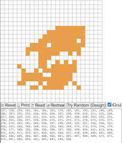

# Orange Pixels
Orange Pixels is a [Generative ORC-721](https://github.com/ordbase/generative-orc-721) project designed to give collector/creators the ability to create any 24x24 px 1 color image with a transparent background. Orange Pixels is an attempt to demonstrate one way on chain data can be used to generate more complex and customizable creations.

       

## Is Orange Pixels Recursive?
By definition, the ORC-721 protocol is recursive since images are composed by referencing previously inscribed source data via the protocol. The protocol layers the source images from [the spritesheet](./spritesheet.png) to create a composite. Minted pieces are JSON files that need rendered by an external process to be viewed as images. 

As with other methods of inscribing recursively, experimentation is required to allow ideas for maximum composability and customization to rise to the top, and there are many lines of thinking when it comes reading and rendering pre-inscribed data. I support the experimentation with multiple methods for storing and referencing data on chain.

## How Does Orange Pixels Work?
Orange pixels references a 576 tile spritesheet (24 x 24).


Each tile contains 1 colored pixel with a transparent background in a 24 x 24 grid.


Inscribers can use "g" values of 0 - 575 to represent any pixel position(s) in a 24 x 24 grid to create a 2 color composite image.

## How to Create an Image

Following are 2 ways to generate the "g" values to will use to create an image, although it is easy to contceive others methods.

### Method #1 - Use the painter created by @geraldb to generate a pre-designed or custom image
1. Open [the painter](https://zimmerallday.github.io/orangepixels/index)
2. Upon load, one of the pre-designed images will randomly show in the pixel canvas. The "g" values for the image are shown below in the text box, see example:


   
   
3. To try a different random image, click the 'Try Random (Design)' button
4. To draw an image freehand, you can click individual pixels to select/desect them, or drag the cursor to select as you go. Once you are happy with your design, click the 'Print' button to generate the "g" values for your image.
5. There are additional, intuitive features of the painter than can be understood through use

### Method #2 - Count colored pixels from a custom source image file
If you already have a 24 x 24 pixel file you want to recreate, use the [count_pix.py](https://github.com/ZimmerAllDay/orangepixels/blob/main/image_reader/count_pix.py) script to generate a number string of colored pixels from the 24 x 24 px file. Note, the script will return a value for all colored pixels, so this method currently only supports silohuette style images.

I manually edited Ordinal Punk 01 below to create a 2 color image I liked (I messed up the nose):

 

Running the image through the count_pix.py script generates this string, which is a numbered list of every pixel containing a color value:

> 128, 129, 130, 131, 132, 133, 134, 151, 159, 174, 184, 198, 208, 222, 232, 246, 256, 270, 272, 273, 274, 275, 276, 277, 278, 279, 280, 293, 294, 296, 297, 299, 300, 301, 303, 304, 316, 317, 320, 321, 322, 323, 324, 325, 326, 327, 328, 341, 342, 344, 345, 346, 347, 350, 351, 352, 366, 376, 390, 393, 394, 395, 396, 397, 398, 399, 400, 414, 415, 416, 417, 418, 419, 420, 421, 422, 423, 424, 425, 437, 438, 439, 440, 441, 442, 446, 447, 448, 449, 461, 462, 463, 464, 465, 466, 467, 468, 469, 470, 471, 472, 473, 485, 486, 487, 488, 489, 490, 491, 492, 493, 494, 495, 496, 497, 510, 511, 512, 513, 514, 515, 516, 517, 518, 519, 520, 521, 534, 536, 537, 538, 539, 540, 541, 542, 543, 544, 558, 562, 563, 564, 565, 566, 567

The string can be used for the "g" values of a colleciton inscription, like this:

```json
{
   "p":"orc-721",
   "op":"mint",
   "s":"orangepixels",
   "g":[128, 129, 130, 131, 132, 133, 134, 151, 159, 174, 184, 198, 208, 222, 232, 246, 256, 270, 272, 273, 274, 275, 276, 277, 278, 279, 280, 293, 294, 296, 297, 299, 300, 301, 303, 304, 316, 317, 320, 321, 322, 323, 324, 325, 326, 327, 328, 341, 342, 344, 345, 346, 347, 350, 351, 352, 366, 376, 390, 393, 394, 395, 396, 397, 398, 399, 400, 414, 415, 416, 417, 418, 419, 420, 421, 422, 423, 424, 425, 437, 438, 439, 440, 441, 442, 446, 447, 448, 449, 461, 462, 463, 464, 465, 466, 467, 468, 469, 470, 471, 472, 473, 485, 486, 487, 488, 489, 490, 491, 492, 493, 494, 495, 496, 497, 510, 511, 512, 513, 514, 515, 516, 517, 518, 519, 520, 521, 534, 536, 537, 538, 539, 540, 541, 542, 543, 544, 558, 562, 563, 564, 565, 566, 567]
}
```

 
Once you have generated your "g" values using these or other methods, you can paste the values into the to [generate.rb](https://github.com/ZimmerAllDay/orangepixels/blob/main/generate.rb) file which will use the spritesheet to recreate the image:


## Additional Features
Want to use a different color from Bitcoin Orange? Follow these steps:
1. Edit the desired color input and run the [generate_pix.py](./generate_pix.py) script to generate 576 tiles in the color of your choosing.
2. Run the [compile_pix.rb](./compile_pix.rb) script to create a new spritesheet in the new color
3. Follow the steps above to generate an image in your new color


